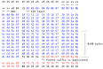
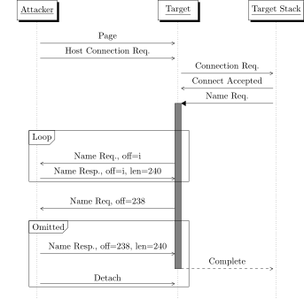

# Extended Inquiry Response Exploit - CVE-2019-11516

## Disclosure timeline
* Found by Jan and reported in April 2019.
* Fixed in AOSP in August 2019, silently fixed in iOS 12.4 or earlier.

## Vulnerablility
This section describes a Heap Based Buffer Overflow affecting Broadcom Bluetooth Controllers ~2010-2018 and was fixed in February 2018.
We could confirm this fix by analyzing the ROM from the BCM4375B1 but despite that, we did not observe any patch in the wild.
It can be triggered if the device is in the inquiry scan mode, what happens in a device scan.
<!-- We were able to exploit this flaw to an RCE by using the technique described in \autoref{sec:free_overflow}. -->
A list of tested devices:

Chip                | Device                             | Build Date   | Vulnerable
--------------------|------------------------------------|--------------|------
BCM20702            | Thinkpad T430                      |  < 2010?     | Yes
BCM4335C0           | Nexus 5, Xperia Z3 Compact, Samsung Galaxy Note 3, LG G4    |  Dec 11 2012 |Yes
BCM4345B0           | iPhone 6 (unfixed in iOS 12.4) | Jul 15 2013 | Yes 
BCM4358A3           | Samsung Galaxy S6, Nexus 6P        | Oct 23 2014  | Yes
BCM4345C1           | iPhone SE (prior iOS 12.4)         | Jan 27 2015  | Yes 
Unknown             | Samsung Galaxy A3 (2016)           | Unknown      | Yes
BCM20707            | Fitbit Ionic                       | Unknown      | Yes
BCM4347B0           | Samsung Galaxy S8                  | Jun 3 2016   | Yes
BCM4347B1           | iPhone 8/X/XR (prior iOS 12.4)     | Oct 11 2016  | Yes 
Unknown             | Samsung Galaxy 9+/Note 9           | Unknown      | Yes
CYW20735B1          | Evaluation Board                   | Jan 18 2018  | Yes
BCM4375B1           | Samsung Galaxy S10e/S10/S10+       | Apr 13 2018  | No 
CYW20819A1          | Evaluation Board                   | May 22 2018  | Yes

## Reproducing the Bug

To run this exploit, a modified firmware is needed.
We provide a patch for the CYW20735B1 that can be loaded using the modified internalblue.

    loadelf projects/CYW20735B1/gen/CVE_2019_11516.patch

To crash a remote device run

    bash projects/CYW20735B1/gen/CVE_2019_11516.sh hci1 ca:fe:ba:be:13:37


## Bug Description
While Creating the HCI Extended Inquiry Response (EIR) event, the firmware has a Heap Buffer Overflow.
The length of the EIR packet is extracted from the payload header, named `pkt_log` in the firmware.
According to the standard, the payload header has the structure shown in the following.
Note that the Reserved For Future Use (RFU) field should be set to zero.


The flaw happens in `eir_handleRx`.
Even though the length field of the packet payload seems to be validated correctly, the RFU bits are not discarded.
By setting the RFU bits to one, we can set `eir_rx.len` to a significantly larger value than the expected 240 bytes.
Setting these bits has no further impact on packet transmission or reception.

```c
void eir_handleRx() {
    ...
    pkt_type = (pkt_hdr_status >> 3) & 0xf;
    ...
    if (pkt_type == 3 || pkt_type == 4) {
        eir_rx.len = (pkt_log >> 5) & 0x1f; //Length is 5 bits
    }
    else if (pkt_type == 10 || pkt_type == 11 ||  pkt_type == 14 ||  pkt_type == 15)
        eir_rx.len = (pkt_log >> 5) & 0x1fff; //13 Bits, RFU bits
                                              //are not discarded
                                              //Should be 0x3ff
    }
    ...
}

void bthci_event_SendInquiryResultEvent() {
    event_buf = bthci_event_AllocateEventAndFillHeader(257, 47, 255); //Allocates 265 bytes
    ...
    eir_getReceivedEIR(v1, event_buf + 17);
    ...
}

void eir_getReceivedEIR(int a1, char *target) {
    ...
    memcpy(target, eir_rx.data + 8, eir_rx.len); //Heap Overflow
    ...
}
```

The EIR packet content is copied to the EIR HCI event where the actual overflow occurs.
The function `bthci_event_SendInquiryResultEvent` allocates a 265 byte HCI event, whereas the last 240 bytes are reserved for the EIR packet data.
The function `eir_getReceivedEIR` then copies the packet data into the HCI event buffer with the wrongly computed length.
Even though we will only send 240 bytes, we can control more bytes as described [here](#memory-artifact).

The function`eir_handleRx` is located in the BCS kernel, whereas `bthci_event_SendInquiryResultEvent` is located in the LM thread.
Therefore it is required to call `bluetoothCoreInt_C multiple` times and then perform a context switch to the LM thread to detect this flaw.
This would be virtually impossible by fuzzing a single function.
In addition, in order to reach that code, the device must be in inquiry mode.
Even though a separate snapshot could be obtained, the possibility to attach the emulator to the Bluetooth stack simplified that step.

# Analysis
Devices such as the BCM4335C0 build date 2012 seem to operate stable, even if the heap is corrupted.
In practice, this flaw has almost no impact on pairing, L2CAP and filesharing capabilities, even though this flaw has a potential for RCE.
This is problematic, as there is no way to test for this flaw, except analyzing the heap.
Therefore we decided to further evaluate the exploitability.

We have exploited this flaw to RCE on the CYW20735B-01 and BCM4335C0.
The exploit strategy consists of the following steps:

- Corrupt the free list of the Block buffers on the heap, to point to an arbitrary memory location.
- Allocate buffers on the target device containing attacker controlled data, that will be written to the target location.
- Trigger execution of our shellcode, that is located in the buffer allocated in step 2.


The affected Block buffers have lengths of 264, 268 or 384 bytes, depending on the device.
On modern devices that Block pool contains 10 buffers, whereas the BCM20702 only has three.
The overflow can therefore reach the next Block on the BCM20702, which is used for the receive buffers.
As those are allocated, the device crashes as inquiry ends and the corrupted buffers are freed.

```
[ Idx ] @Pool-Addr  Buf-Size  Avail/Capacity  Mem-Size @ Addr
-----------------------------------------------------------------
BLOC[0] @ 0x205DC8:       32     7 /  8            288 @ 0x2179A4
BLOC[1] @ 0x205DF8:       64     7 /  8            544 @ 0x217AC4
BLOC[2] @ 0x205E28:      264    10 / 10           2680 @ 0x217CE4
     ^-- Affected BLOC buffers
BLOC[3] @ 0x205E88:     1064     2 /  4           4272 @ 0x21C624
BLOC[4] @ 0x205E58:     1092    16 / 16          17536 @ 0x21D6D4
BLOC[5] @ 0x20EC38:       40    15 / 15            660 @ 0x221B54
BLOC[6] @ 0x20EC68:       32    15 / 15            540 @ 0x221DE8
```

We need three allocations to return the corrupted pointer in `dynamic_memory_AllocateOrDie`.
If this buffer is returned, it will treated as a HCI event buffer and therefore either data will be overwritten or the device crashes if the pointer is invalid.
Note that the HCI EIR packet is sent to the host and deallocated immediately.


# Memory Artifact
We send a 240 bytes payload, so the complete EIR packet should fit into the HCI event buffer.
It is expect to overflow the Block header with random data, what would make this flaw way harder to exploit.
There is an memory artifact in the receive buffer that is mapped to RAM.
A memory dump of this buffer is shown below.
This hexdump was obtained on the BCM2072, but the same behavior can be observed on all devices.
Prior to the overflow, all block bufferes were cleared indicated by values `0x25` and `0x26`.
A pattern of ascending values were chosen for the EIR packet.
The middle of the EIR packet is duplicated at the end.
This artifact seems to be cause be the receiving hardware and is essential for our exploit, as it allows us to control the header of the next Block buffer.




# Heap-Spraying Using "Read Remote Name"
This will dereference the corrupted pointer and the firmware will treat it as a Block buffer.
If we can also control the content of that buffers, we will have a Write-What-Where gadget.
This can be used to overwrite functions or function pointers in RAM to gain RCE.

A successfull way of heap-spraying is to trigger "Read Remote Name Response" HCI events.
Those events are allocated, as a "Read Remote Name" HCI command is received.
In order to trigger those commands, we need to connect from a Bluetooth address, that is not known by the host, which will try to resolve the name.
This was achieved, by setting a hook on `bthci_cmd_lc_HandleCreate_Connection` and randomizing the address on every connect.





In addition, we have to ensure, that those HCI events are not sent to the host and therefore be deallocated.
The remote name is sent via LMP packets, that carry 14 bytes of payload.
As the device name can be much longer, it is fragmented across multiple packets.
The HCI event is released either if the name was transmitted completely or if a timeout occurs.
By discarding the last packet of the name transmission and disconnecting from the target without notification, the target will hold the buffer until the timeout occurs. 
This process is repeated over and over again, until our overflowed pointer was taken from the free list.
An HCI event will be written to that address, which has a structure as shown in the following.
The device name will carry the actual payload.

```
     4           9            238             18
+----------+------------+-------------+------------------+
| BLOC Hdr | HCI header | Device Name | (Not Controlled) |
+----------+------------+-------------+------------------+
```

This technique has some limitations that are important for exploitation.
First, we need multiple packets to send our payload.
Therefore we have to ensure not to crash the firmware, while it receives our payload.
The whole buffer is zeroed on allocation and the first 13 and last 18 bytes cannot be controlled.

Second, the attacker has no feedback on the current heap layout.
We have to ensure the shellcode is called prior to the next buffer allocation, which has to repair the currupted heap.
Otherwise, we will dereference any data, that is located at our overflowed address and treat it as a heap buffer.
In most cases, this will cause a crash.

